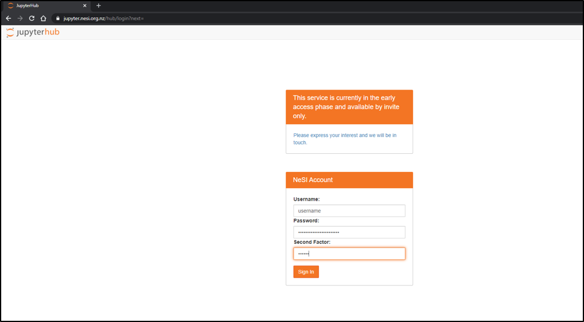
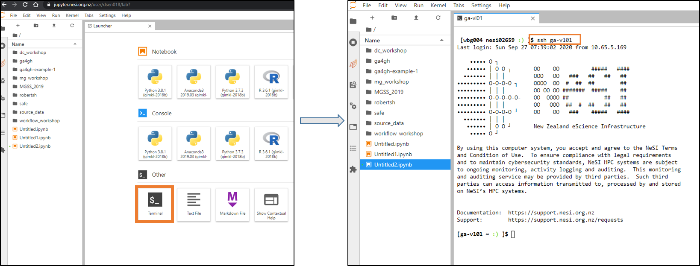

1. Follow https://jupyter.nesi.org.nz/hub/login
2. Enter NeSI username, HPC password and 6 digit second factor token 
3. Choose server options as below 
4. Login to `ga-vl01` virtual machine vie jupyter terminal 