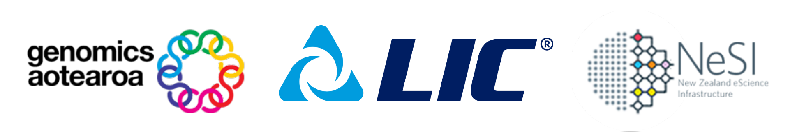

{width="550"}

# Genotype Imputation

!!! quote ""

    This specialist workshop, hosted by LIC with the support of Genomics Aotearoa and NeSI, is for researchers ready to explore the technique of genotype imputation. Genotype imputation is a cost-efficient approach to approximate high-density genotypes or full sequence data from low-density genotypes/low-pass sequencing data of individuals. This workshop is intended for anyone interested in learning how to use either Beagle or Minimac to impute genotypes and how to evaluate the imputation performance. A brief overview of imputation will be followed by demonstrations and exercises on the following topics:

       - Quality control and preparation of genetic data for imputation 
       - Evaluating the imputation performance using different parameters
 
## Prerequisites:

To get the most out of this workshop, it is encouraged that attendees know about basic genetics and genomics and have familiarity with bash and R.